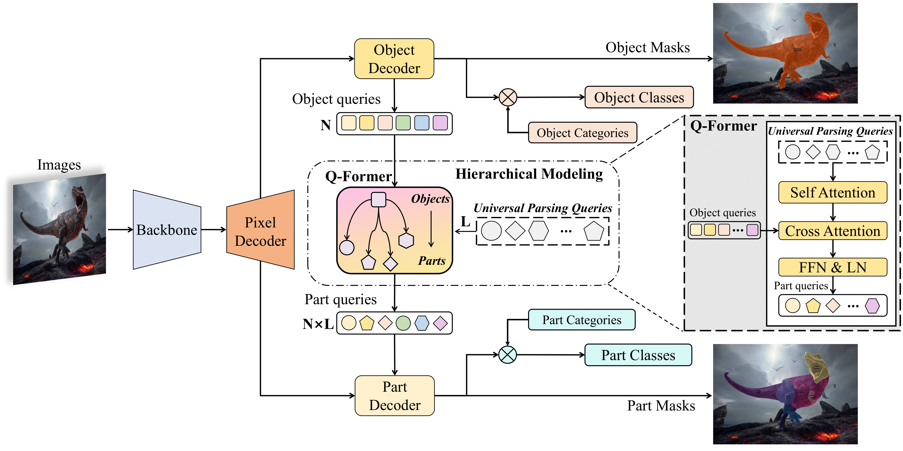
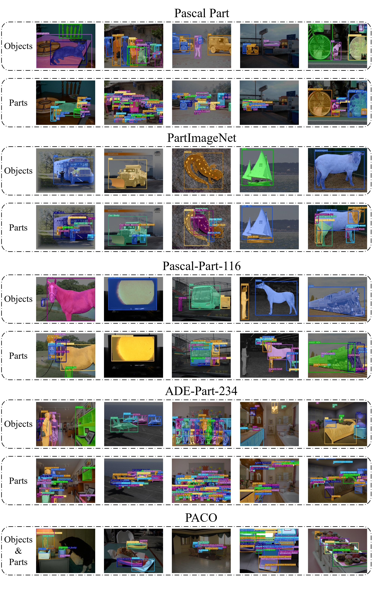
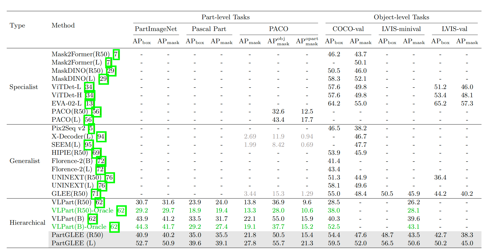
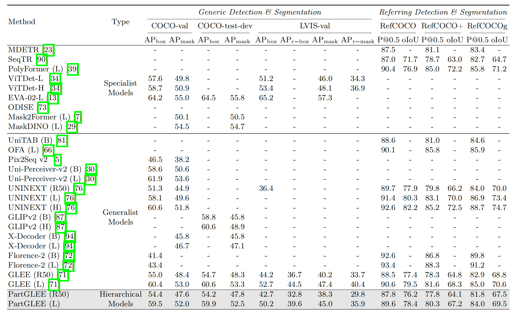
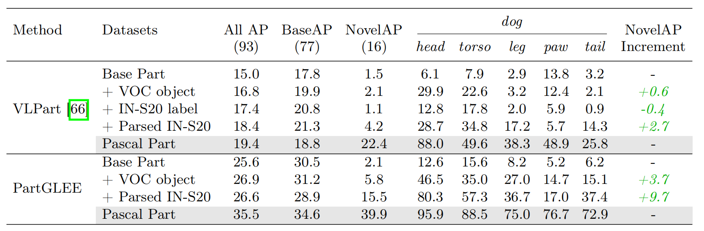
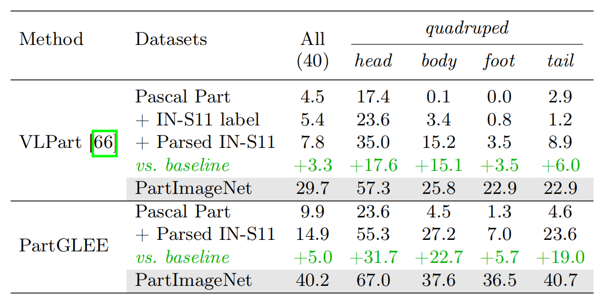
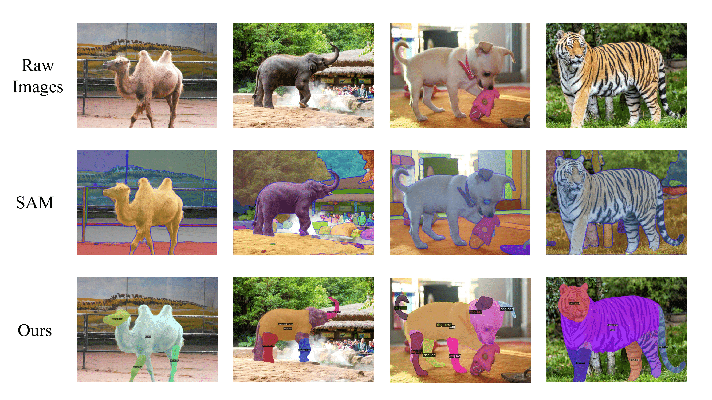
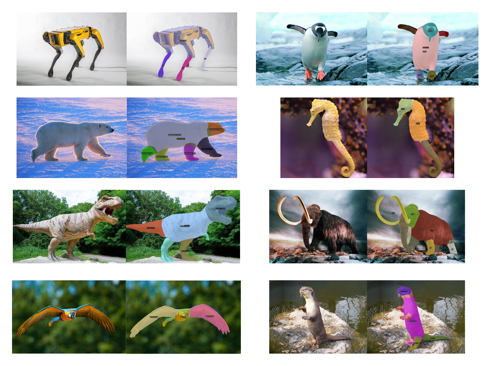

<div align="center">
<h2>PartGLEE: A Foundation Model for Recognizing and Parsing Any Objects</h2>

[**Junyi Li**](https://github.com/ProvenceStar)<sup>1*</sup> · [**Junfeng Wu**](https://wjf5203.github.io/)<sup>1*</sup> · [**Weizhi Zhao**](https://weizhi-zhao.github.io/)<sup>1</sup> · [**Song Bai**](https://songbai.site/)<sup>2</sup> · [**Xiang Bai**](http://vlrlab.aia.hust.edu.cn/)<sup>1&dagger;</sup>

<sup>1</sup>Huazhong University of Science and Technology&emsp;&emsp;&emsp;<sup>2</sup>Bytedance Inc.

*Equal Contribution&emsp;&emsp;&dagger;Corresponding Author

<a href="https://arxiv.org/abs/2407.16696"></a>
<a href='https://provencestar.github.io/PartGLEE-Vision/'></a>
</div>

# Highlight:

- PartGLEE is accepted by **ECCV2024**!
- PartGLEE is a part-level foundation model for locating and identifying both **objects** and **parts** in images.
- PartGLEE accomplishes detection, segmentation, and grounding of instances at **any granularity** in the **open world** scenario.
- PartGLEE achieves **SOTA** performance across various part-level tasks and obtain competitive results on traditional object-level tasks.

We will release the following contents for **PartGLEE**:

- [ ] Demo Code

- [ ] Model Zoo

- [ ] Comprehensive User Guide

- [ ] Training Code and Scripts

- [ ] Evaluation Code and Scripts

<!-- # Getting started

1. Installation: Please refer to [INSTALL.md](assets/INSTALL.md) for more details.
2. Data preparation: Please refer to [DATA.md](assets/DATA.md) for more details.
3. Training: Please refer to [TRAIN.md](assets/TRAIN.md) for more details.
4. Testing: Please refer to [TEST.md](assets/TEST.md) for more details. 
5. Model zoo: Please refer to [MODEL_ZOO.md](assets/MODEL_ZOO.md) for more details. -->

# Introduction 

We present PartGLEE, a **part-level foundation model** for locating and identifying both objects and parts in images. Through a unified framework, PartGLEE accomplishes detection, segmentation, and grounding of instances at any granularity in the open world scenario. Specifically, we propose a **Q-Former** to construct the hierarchical relationship between objects and parts, parsing every object into corresponding semantic parts.


PartGLEE is comprised of an image encoder, a Q-Former, two independent decoders and a text encoder. We propose a Q-Former to establish the **hierarchical relationship** between objects and parts. A set of parsing queries are initialized in the Q-Former to interact with each object query, parsing objects into their corresponding parts. This Q-Former functions as a decomposer, extracting and representing parts from object queries. Hence, by training jointly on extensive object-level datasets and limited hierarchical datasets which contain object-part correspondences, our Q-Former obtains **strong generalization ability** to parse any novel object into its consitute parts.



# Datsets Unification

To facilitate training our Q-Former, we augment the original part-level datasets with object-level annotations to **establish hierarchical correspondences**. Specifically, we add object-level annotations to Pascal Part, PartImageNet, Pascal-Part-116, ADE-Part-234, in order to establish the hierarchical correspondence between objects and parts. We further introduce a subset of the open-world instance segmentation dataset SA-1B and augment it into a **hierarchical dataset**, thus further improving the generalization capability of our model.




# Results

## Hierarchical Cognitive Performance



## Tradition Object-level Tasks



## Generalization Performance

### Cross Category Generalization Performance



### Cross Dataset Generalization Performance



# Visualization Results

## Comparison with SAM



## Visualization of Generalization Capability



# Citing PartGLEE

```
@article{li2024partglee,
  title={PartGLEE: A Foundation Model for Recognizing and Parsing Any Objects},
  author={Li, Junyi and Wu, Junfeng and Zhao, Weizhi and Bai, Song and Bai, Xiang},
  journal={arXiv preprint arXiv:2407.16696},
  year={2024}
}
```

## Acknowledgments

- Thanks [GLEE](https://github.com/FoundationVision/GLEE) for the implementation of multi-dataset training and data processing.

- Thanks [MaskDINO](https://github.com/IDEA-Research/MaskDINO) for providing a powerful detector and segmenter. 
